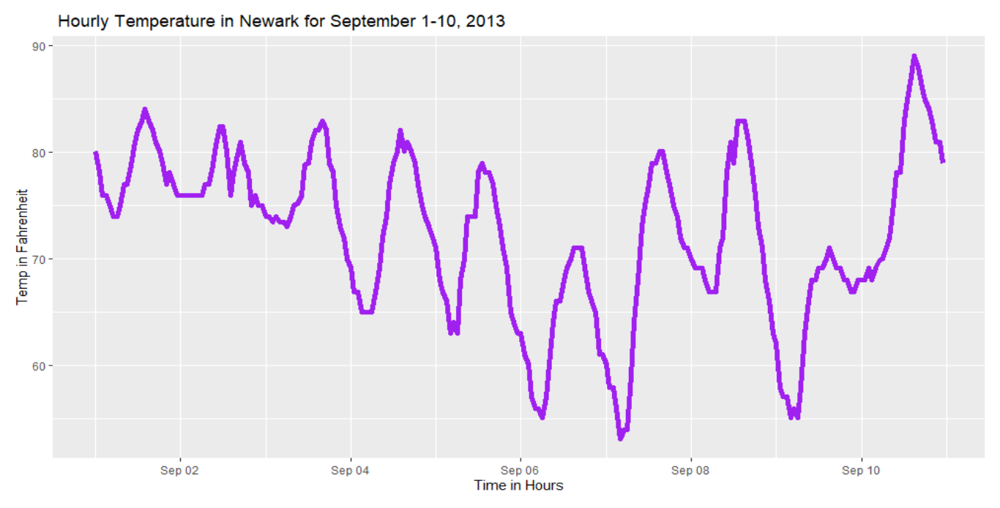

```{r, warning = FALSE, message = FALSE}
# Load any R Packages you may need
library(nycflights13)
library(tidyverse)
library(ggridges)

```

```{r, echo = FALSE, warning = FALSE, message = FALSE}
# Load any data sets you may need
early_september_weather <- weather %>% 
  filter(origin == "EWR" & month == 9 & day <= 10)


#ggplot(data = early_september_weather, mapping = aes(x = time_hour, y = temp_F)) +
  #geom_line(color = "purple", size=2) + labs(x = "Time in Hours", y = "Temp in Fahrenheit", title = " Hourly Temperature in Newark for September 1-10, 2013")

```


# Linegraph of hourly temperature in Newark from September 1-10, 2013.

- Using the R package: nycflights13 and the "weather" data set
- The origin == "EWR" which stands for "Newark"referred to the Newark airport

*Above displays a line graph time series where the x-axis represents the time (in hours) and the temperature in degrees Celsius.*

**What can we take from this Graphic:**

## Hour and Temperature connection:
*What we can take from the graph is that the recorded temperature at the Newark airport corresponds to the weather stations reports and merges that with time in hours from September 1-10 documented in Newark*

### Maximum and Minimum in the Linegraph:

**We can observe that the temperature in Fahrenheit is the highest a little after September 10th. And the lowest temperature recorded was around September 7th.**

```{r, echo = FALSE, warning = FALSE, message = FALSE}
early_september_flights <- flights %>% 
  filter(origin == "EWR" & month == 9 & day <= 10)


ggplot(data = early_september_flights, mapping = aes(x = time_hour, y = dep_delay)) +
  geom_jitter(color = "red") + geom_boxplot(color = "blue")+ labs(x = "Time in Hours", y = "Departure Delay", title = " Departure Delay by Time in Newark for September 1-10, 2013")
```
# Strip Plot + boxplot of hourly Departure Delay in Newark from September 1-10, 2013.

- Using geom_jitter and geom_boxplot, the graphic shows the Departure Delay from September 1-10th in 2013 for the Newark airport.
- The graph highlights the Departure delay through two graph types, giving us more informatin to observe from the data

*Above displays a strip plot + boxplot where the x-axis represents the time (in hours) and the depature delay in presumed seconds.*

**Comparing both graphics:**

## The Maximum and Minimum:

*What we can take from the graph is that the recorded delay at the Newark airport was the highest a little after September 2nt and was the lowest a little after September 8.*

### The Final Take:
**If we observe both graphics, we can conclude that the boxplot in the second graphic dislayed a clear outlier with the blue dotted line around September 6th. If we look at that same day in the first graph we can notice that the temperature was one of the lowest in the 10 days, below 60 degrees Fahrenheit.We can assume that around September 2nt that the departure delay noted was also an outlier comapred to the other days. Aside from outliers, we can conclude that the higher the temperature in Fahrenheit, the less departure delay there will be.**


